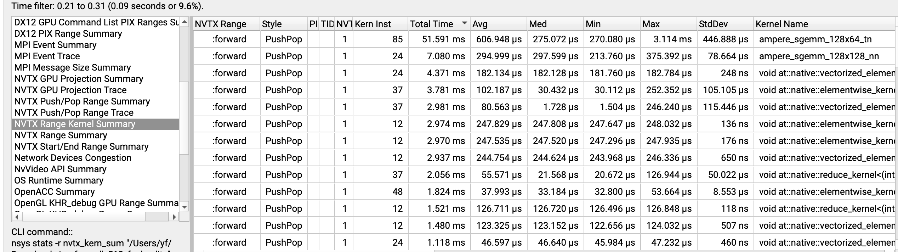
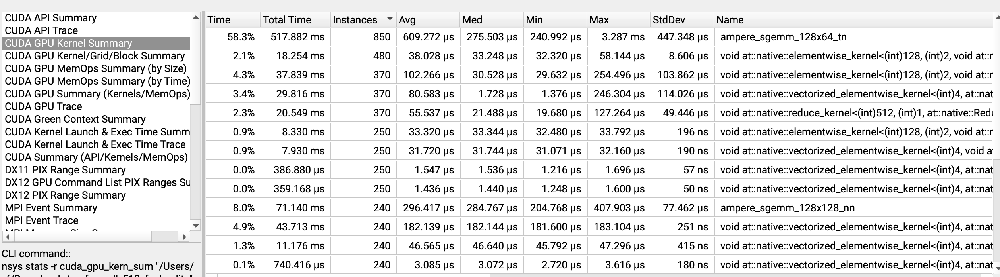
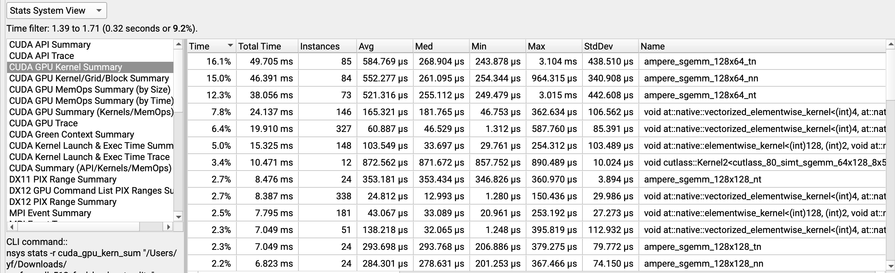
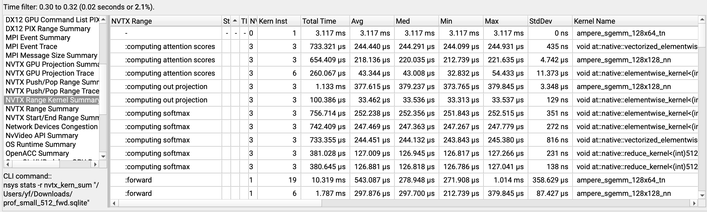

# Benchmark of Model Foward / Backward / Optimizer with nsys profile

### a. nsys vs python timing
nsys forward 92 ms vs Python 88 ms, at small_512_fwd
the reason is profile takes some time

### b. dominant kernel
The kernel launched most times: 
    ampere_sgemm_128x64_tn

The kernel takes most time: ~66%
    ampere_sgemm_128x64_tn

they are the same kernel

### c. other part
elementwise_kernel (~3.8 ms, 37 inst), vectorized_elementwise_kernel (~3.0 ms, 37 inst) doing GELU/residual adds/scaling

reduce_kernel (~2.0 ms) for the softmax and RMSNorm reductions

together roughly 9-10 ms out of ~66 ms, ~15% of forward-pass GPU time

### d. fwd vs full pass
ampere_sgemm_* takes ~43% combined time, the percentage dropped,
since elementwise_kernel launched a lot more instances, because of grad element-wise op, takes total ~20% time

### e. inside attention kernel
softmax takes more time (~3ms) than attention scores (~1.65ms) and out projection (~1.2ms),
despite softmax takes negligible fraction of FLOPs, because its memory-bound

    why memory-bound?
    arithmetic density = k * n^2 /n^2 * dtype ~ 1, << accelerator density at 300 for a100
    so its memory-bound

