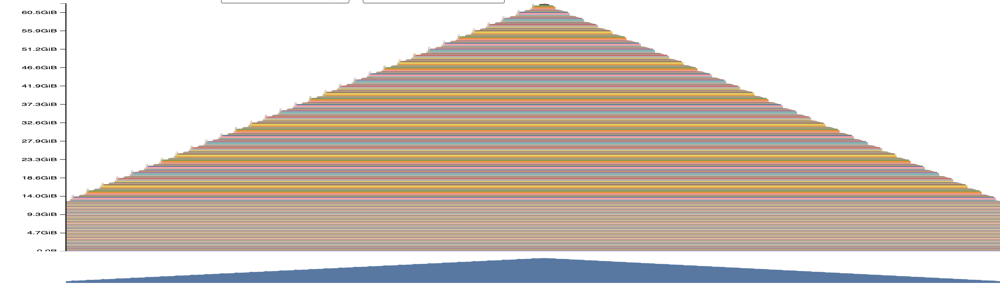
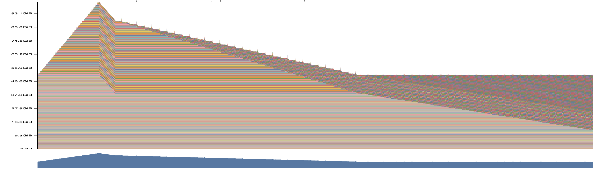
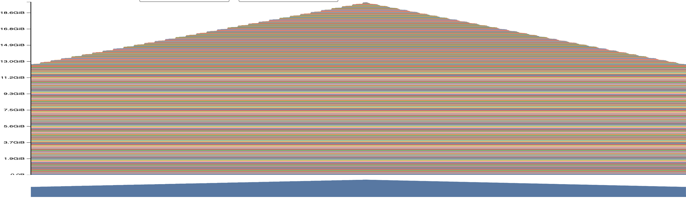
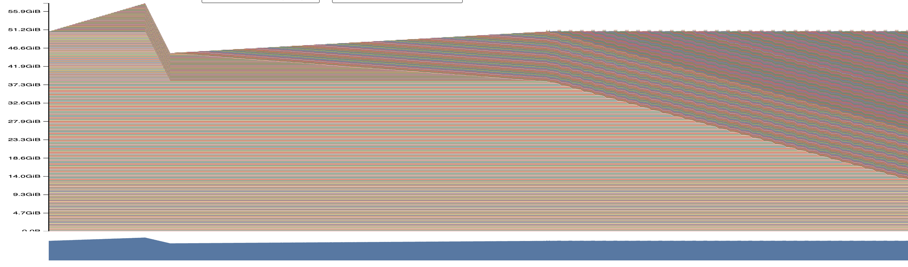

### a.
The fwd memory reach peak at 62GB, full pass memory peak is 102GB, the memory dropped when activation calculated grad and were released.

The flat part (50GB) is the persistent part, including weights, gradients, opt states, it's released when call optimizer.zero_grad()

xl_ctx2048_bf16_fwd
max = 62GB

xl_ctx2048_bf16_full
max = 102GB

### b. peak memory at differnt ctx len
 There's a fixed memory of 40gb for bwd/opt overhead, thats grad and opt states that grow with model size

 The other grow with seqlen linearly.

Peak memory (XL, bf16):

| ctx len | fwd only | full step |
|---|---|---|
| 128 | 18 GB | 55 GB |
| 2048 | 62 GB | 102 GB |

xl_ctx128_bf16_fwd
max = 18GB

xl_ctx128_bf16_full
max = 55GB

### c. mix-precision effect on memory